# poaforte ✊
Repositório para projeto Node.js + React.js + React Native desenvolvido durante a <em>Next Level Week</em> da <strong>Rocketseat</strong>.

<strong>poaforte</strong> é uma plataforma para <em>curadores da comunidade</em> cadastrarem pequenos negócios da região e para <em>pessoas interessadas na causa</em> encontrarem excelentes produtos e serviços feitos por quem vive nas redondezas

facilmente escalável / replicável para outras cidades e regiões

## Description

Projeto desenvolvido durante a Next Level Week da Rocketseat. 
MVP de uma aplicação para cadastrar pequenos negócios locais da comunidade, gerenciada por curadores, com aplicativo para os usuários explorarem os pequenos negócios na sua região.

<em>Project developed at Next Level Week course by Rocketseat.
MVP of an application to register small local businesses, managed by community curators, with an mobile app for users to explore their neighborhood.</em>

## Built with

- Node.js
- React.js
- React Native
- Typescript
- Express
- Celebrate
- Sqlite3

## Author

Otavio Petry
https://www.linkedin.com/in/otaviopetry/

## Screenshots

### Web Home

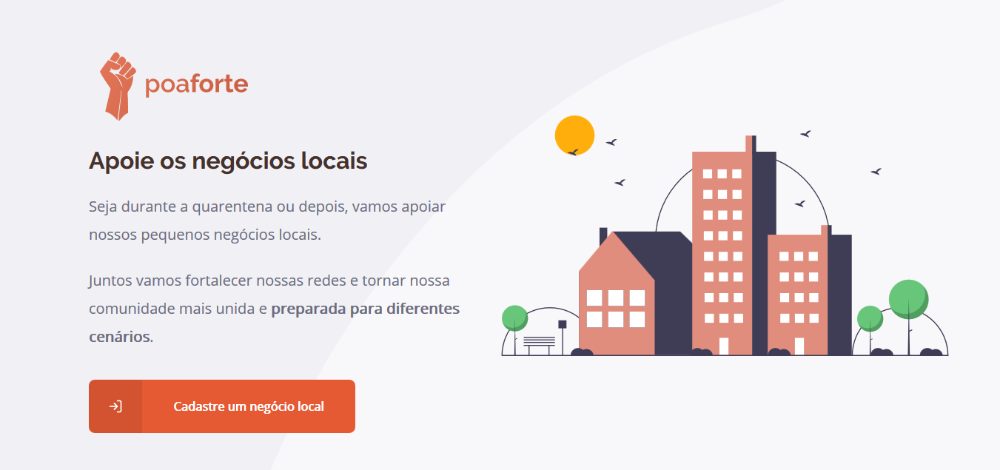

### Cadastro de negócio
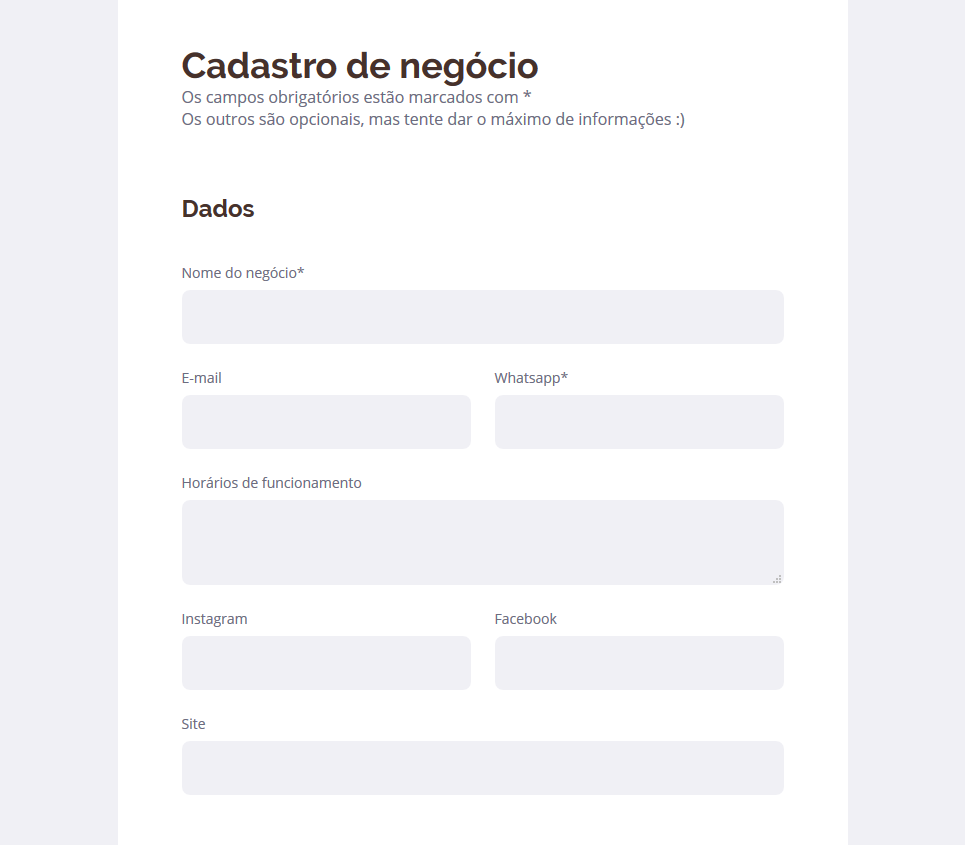
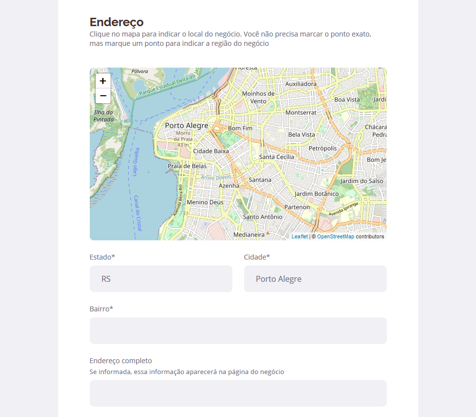
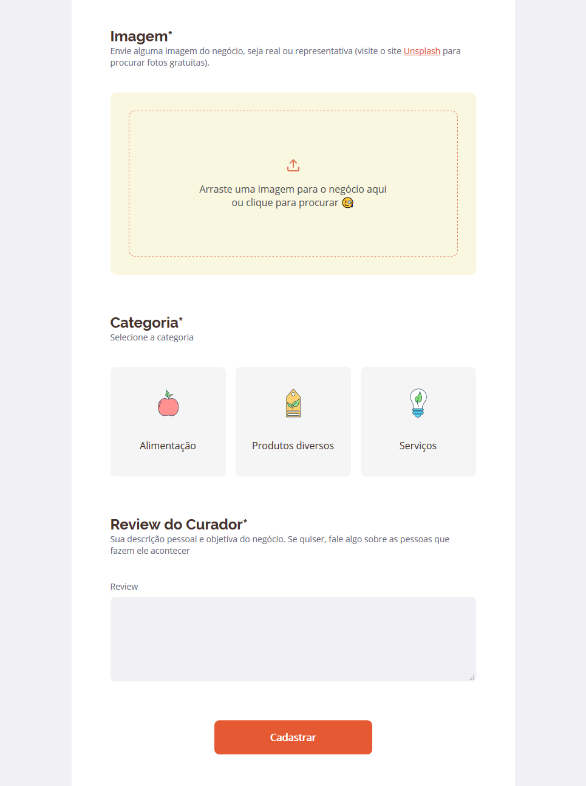
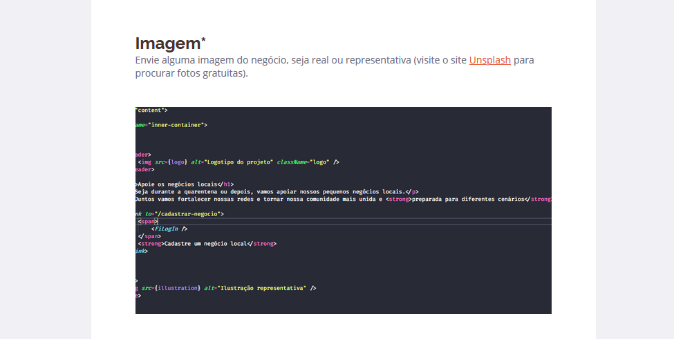

### Mobile App
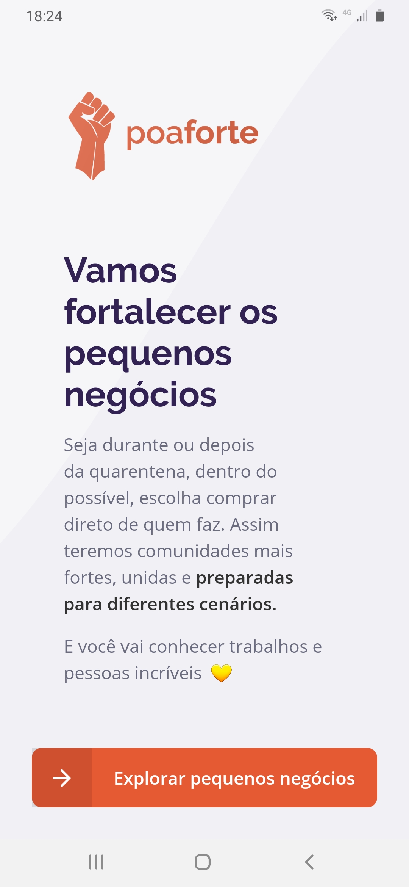
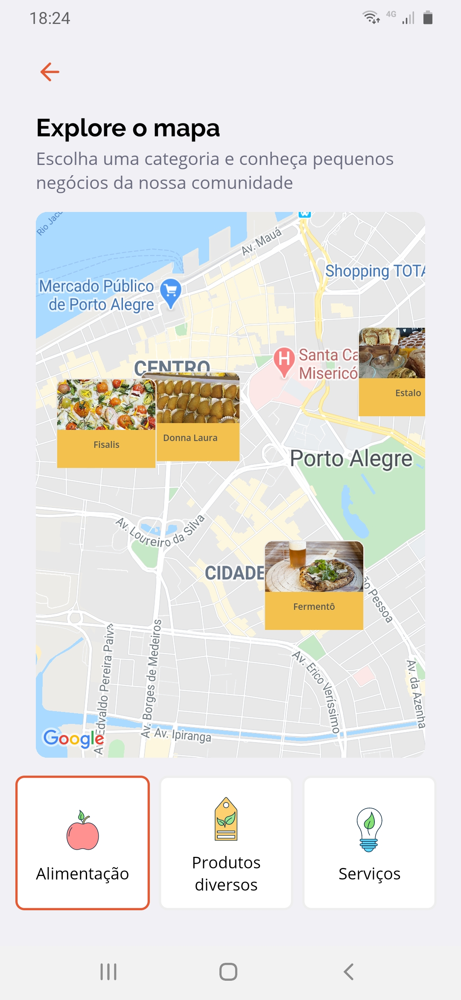
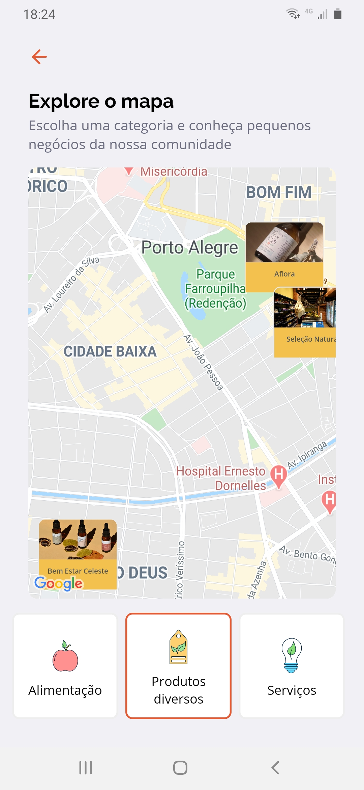
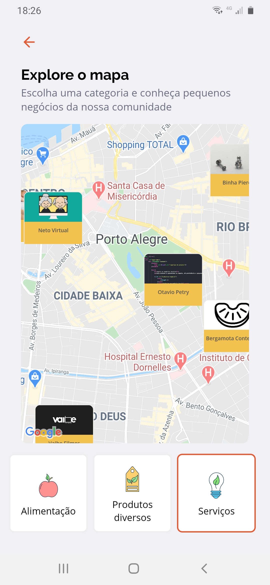
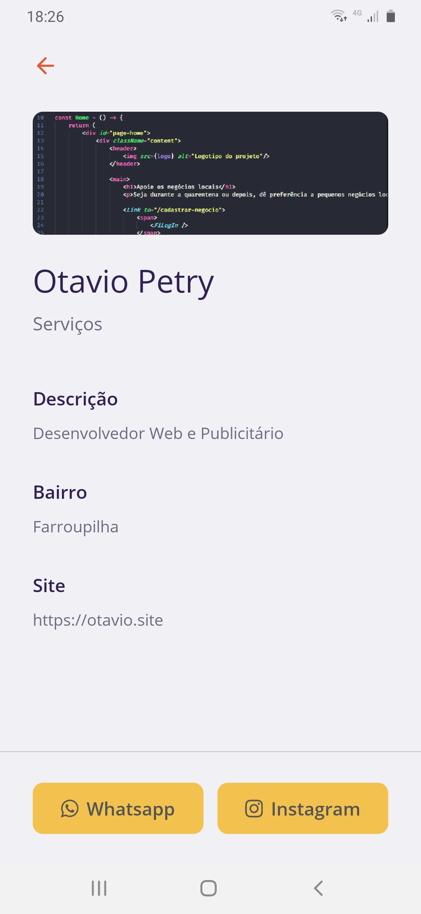
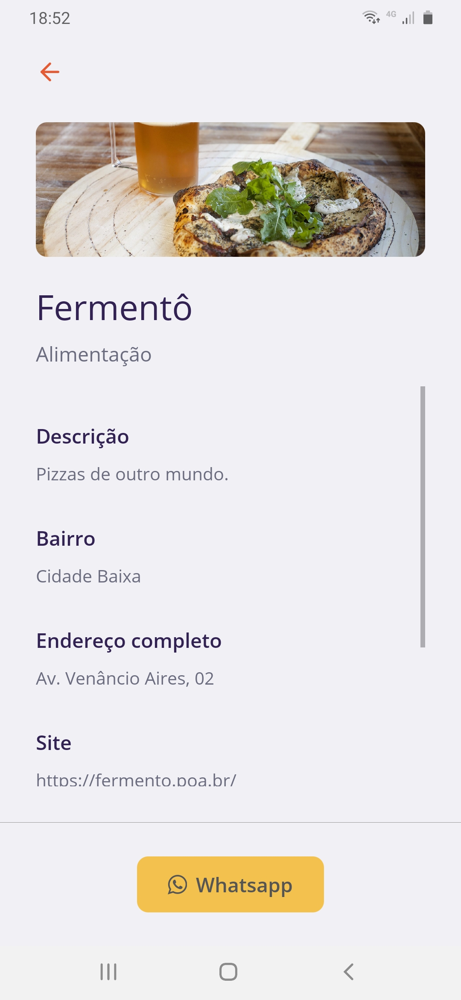
